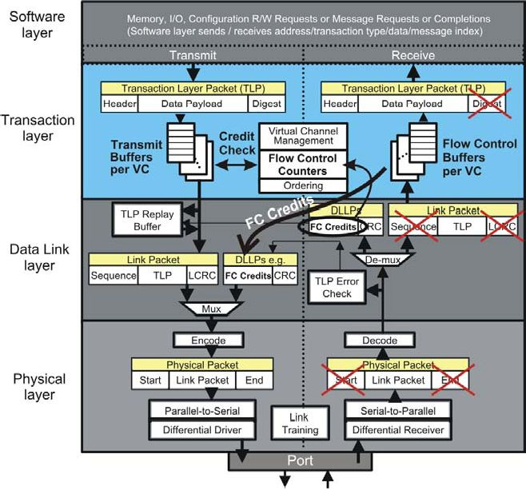
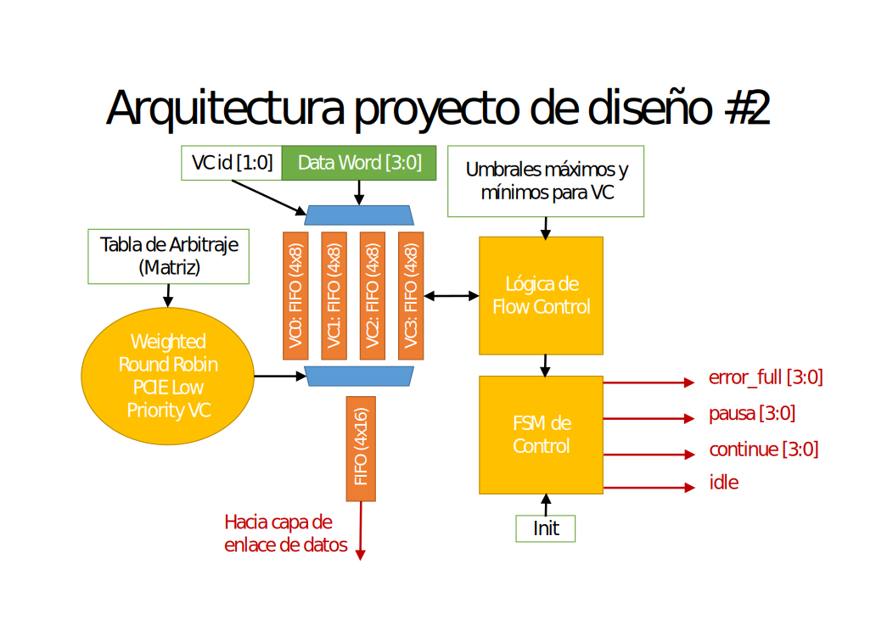
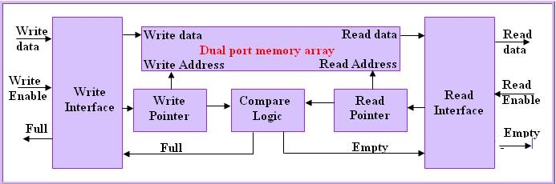
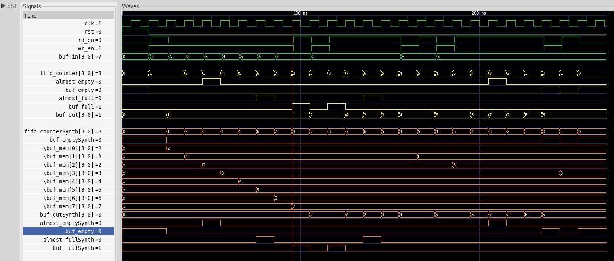

<!-- $theme: default -->

# Diseño de de QoS para PCI

`Primera entrega`
===

Robin Gonzalez
Boanerges Martinez
Emilio Rojas

---

Propuesta de diseño
===

A seguir la especificación del proyecto
<br >
<br >


Algunos conceptos importantes:
===

---

Quality of Service
===
<br >
<br >


- Latencia
 <br >
- Ancho de banda efectivo
 <br >
- Razon de transmision

---

Arbitraje en sistemas digitales
===
<br >
<br >
<br >


- Arbitraje de canal virtual
 <br >
- Arbitraje de puertos

---

# Flow Control
Evita desconexiones, reintentos y estados de espera en el enlace.

## Tres Tipos de transacciones
 - **P** POSTED
 - **NP** NON-POSTED
 - **CPL** COMPLETIONS

---

# Creditos

Se reportan _flow control credits_ (FCCs) al dispositivo conectado indicando espacio disponible en el _buffer_.
Se reciben los FFCs en forma de paquetes en el _data link layer_ (DLLP) y se actualiza un contador de creditos.
Se chequea la cantidad de creditos disponibles, si no hay suficientes para el paquete, bloquea el envio hasta que sea posible continuar.

---
# Creditos



---



---

### [Bloque FIFO](http://electrosofts.com/verilog/fifo.html)

- __Modelo de referencia__ 
- __http://electrosofts.com/verilog/fifo.html__


---

# Bloque ```FIFO```
<br >

#### Diagrama de bloque   
<br >
<br >


<br >

---

# Bloque ```FIFO```
<br >

#### Puertos y parametros
```verilog
module fifo #(parameter BUF_WIDTH = 3)
 (
  output buf_empty, buf_full, almost_full, almost_empty, 
  output [3:0] buf_out,
  output [BUF_WIDTH :0] fifo_counter, 
  input clk, rst, wr_en, rd_en, 
  input [3:0] buf_in
);
parameter BUF_SIZE = ( 1<<BUF_WIDTH );
```
  
---

# Bloque ```FIFO```
<br >

#### Banderas
```verilog
//banderas dependientes de conteo de datos en el fifo
always @(fifo_counter) begin
   buf_empty = (fifo_counter==0);
   buf_full = (fifo_counter== BUF_SIZE);
   almost_full = (fifo_counter == (BUF_SIZE-2));
   almost_empty = (fifo_counter == 3);
end
```

---  

# Bloque ```FIFO```
<br >

#### Test_fifo

```verilog
push(13);
pop(tempdata);
task push;
input [3:0] data;
   if( buf_full )
        $display("---Cannot push: Buffer Full---");
        else
        begin
           $display("Pushed ",data );
			buf_in = data;
			wr_en = 1;
            @(posedge clk);
                #1 wr_en = 0;
        end
endtask
```

--- 


# Bloque ```FIFO```

## Archivo .gtkw de las señales del FIFO




_De: ```fifo_test.v```_


---  

# Conclusiones del Estudio de Mercado

  - Mercado con precios muy competitivos, dificulta ingreso de nuevas empresas.
  - Características similares entre los distintos productos.


---

# División Propuesta del Trabajo

 
 - __Robin__: Isdfsdfsdfsd.
 - __Emilio__: Rasdsfsgfdfgfg.
 - __Boanerges__: Modulo FIFO y su tester.


