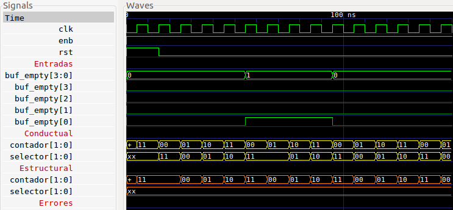

<!-- $theme: default -->

# Diseño de QoS para PCI

Segunda entrega
===

Robin Gonzalez
Boanerges Martinez
Emilio Rojas


---


---

# ```Modulos```

###  ```fifo 4x8```, ```fifo 4x16```, ```mux 4 a 1```

### ```deMux 1 a 4```, ```roundRobin```, ```fsm```

---

# Bloque fifo16
<br >

#### Puertos y parametros
```verilog
module fifo #(parameter BUF_WIDTH = 3)
 (
  output buf_empty, buf_full, almost_full, almost_empty, 
  output [3:0] buf_out,
  output [BUF_WIDTH :0] fifo_counter, 
  input clk, rst, wr_en, rd_en, 
  input [3:0] buf_in
);
parameter BUF_SIZE = ( 1<<BUF_WIDTH );
```
  
---

# Mux-Demux
<br >

#### Puertos y parametros

```verilog

codigo

```
---

# Mux-Demux


---

# Round Robin
<br >

#### Puertos y parametros

```verilog

codigo

```
---

# Round Robin




---

# Flow Control
<br >

#### Puertos y parametros

```verilog

codigo

```

---

# Flow Control

simulacion

---


