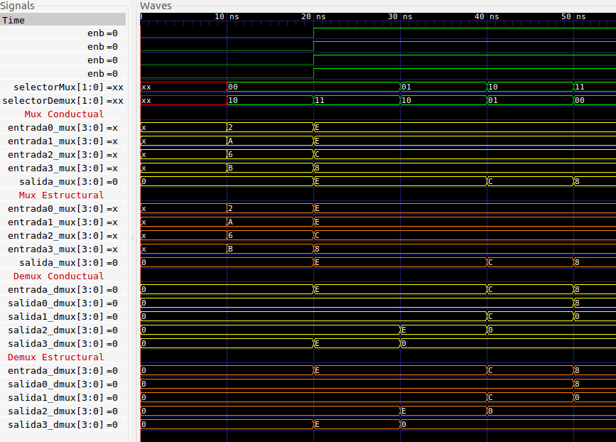
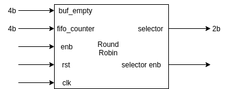
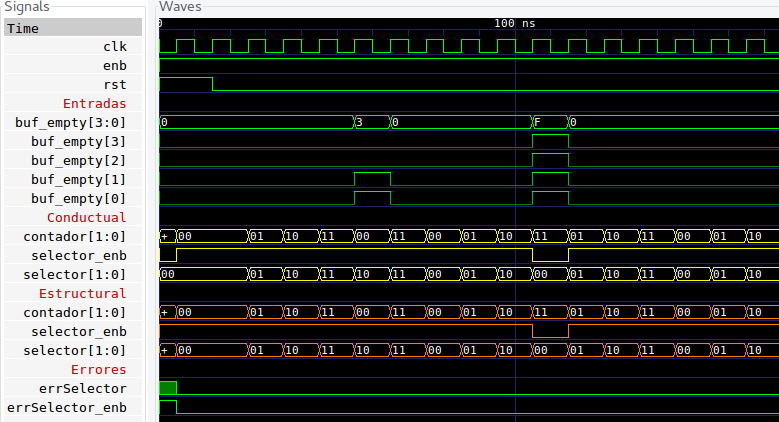

<!-- $theme: default -->

# Dise単o de QoS para PCI

Segunda entrega
===

Robin Gonzalez
Boanerges Martinez
Emilio Rojas


---


---

# ```Modulos```

###  ```fifo 4x8```, ```fifo 4x16```, ```mux 4 a 1```

### ```deMux 1 a 4```, ```roundRobin```, ```roundRobinPesado```, ```fsm```

---
 
 # Bloque fifo16
<br >

#### Diagrama de bloque


  
---

# Bloque fifo16
<br >

#### Puertos y parametros
```verilog
module fifo16 #(
parameter BUF_WIDTH = 4, 
parameter DATA_WIDTH = 4
)(
  output reg buf_empty, buf_full, almost_full, almost_empty, 
  output reg [(DATA_WIDTH-1):0] buf_out,
  output reg [BUF_WIDTH :0] fifo_counter,
  input clk, rst, wr_en, rd_en, 
  input [(DATA_WIDTH-1):0] buf_in
);
parameter BUF_SIZE = ( 1<<BUF_WIDTH );
```
  
---

 # Bloque fifo16
<br >

#### Archivo .gtkw de las señales del fifo16


_De: ```fifo16_test.v```_

---

 # Bloque Mux
<br >

#### Diagrama de bloque


---
 # Bloque Demux
<br >

#### Diagrama de bloque


  
---

# Bloque Mux-Demux
<br >

#### Puertos y parametros

```verilog

module mux #(parameter DATA_BITS = 4) (
  input enb,
  input [DATA_BITS -1:0] entrada0_mux,
  input [DATA_BITS -1:0] entrada1_mux,
  input [DATA_BITS -1:0] entrada2_mux,
  input [DATA_BITS -1:0] entrada3_mux,
  input [$clog2(DATA_BITS) -1:0] selector_mux,
  output [DATA_BITS -1:0] salida_mux
);

```
---

# Bloque Mux-Demux
<br >

#### Archivo .gtkw de las señales del muxDemux_test


_De: ```muxDemux_test.v```_

---

 # Bloque Round Robin
<br >

#### Diagrama de bloque


  
---


# Round Robin

#### Puertos y parametros

```verilog
module roundRobin #(
  parameter QUEUE_QUANTITY = 4, 
  parameter DATA_BITS = 8, 
  parameter MIN_FIFO_COUNTER = 3
) (
  input clk, input rst, input enb,
  input [QUEUE_QUANTITY-1:0] buf_empty,
  input [QUEUE_QUANTITY-1:0] fifo_counter,
  output [$clog2(QUEUE_QUANTITY)-1:0] selector,
  output selector_enb
);

```
---


# Round Robin

<br >

#### Archivo .gtkw de las señales del roundRobin_test



_De: ```roundRobin_test.v```_

---


 # Bloque Round Robin Pesado
<br >

#### Diagrama de bloque


  
---


# Round Robin Pesado

#### Puertos y parametros

```verilog
module roundRobinPesado #(
  parameter QUEUE_QUANTITY = 4,
  parameter DATA_BITS = 8,
  parameter BUF_WIDTH = 3,
  parameter MAX_WEIGHT = 64
) (
  input clk, input rst, input enb,
  input 
  [((QUEUE_QUANTITY)*($clog2(MAX_WEIGHT)))-1:0] pesos,
  input [QUEUE_QUANTITY-1:0] buf_empty,
  input [(QUEUE_QUANTITY*BUF_WIDTH)-1:0] fifo_counter,
  output [$clog2(QUEUE_QUANTITY)-1:0] selector,
  output selector_enb
);

```
---


# Round Robin Pesado
<br >

#### Archivo .gtkw de las señales del roundRobinPesado_test


_De: ```roundRobinPesado_test.v```_

---
# Flow Control
<br >

#### Puertos y parametros

```verilog

codigo

```

---

# Flow Control
<br >

#### Archivo .gtkw de las señales del fsm_test


_De: ```fsm_test.v```_

---


