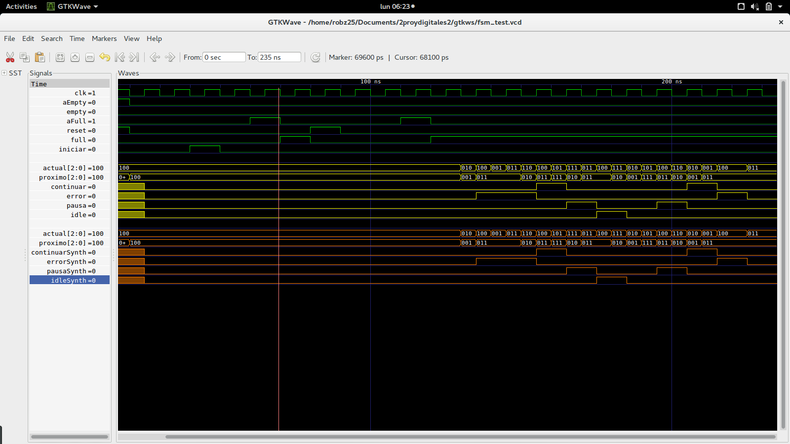

<!-- $theme: default -->

# Diseño de QoS para PCI

Tercera entrega
===

Robin Gonzalez
Boanerges Martinez
Emilio Rojas

---

# ```Avances```

###  ```Round Robin Arbitrado```, ```FSM```, ```Makefile```

### ```transmisor```

---
 
 # Bloque Round Robin
<br >

#### Diagrama de bloque


  

---

# Bloque Round Robin Arbitrado

```verilog
module roundRobinArbitrado #(
  parameter QUEUE_QUANTITY = 4,
  parameter DATA_BITS = 8,
  parameter BUF_WIDTH = 3,
  parameter MAX_WEIGHT = 64,
  parameter TABLE_SIZE = 8
) (
  input clk, rst, enb,
  [((QUEUE_QUANTITY)*($clog2(MAX_WEIGHT)))-1:0] pesos,
  [(TABLE_SIZE*$clog2(QUEUE_QUANTITY))-1:0] selecciones,
  [QUEUE_QUANTITY-1:0] buf_empty, 
  [(QUEUE_QUANTITY*BUF_WIDTH)-1:0] fifo_counter,
  output [$clog2(QUEUE_QUANTITY)-1:0] selector, 
  selector_enb
);
```
  
---


 # Makefile
<br >

#### Comandos unicos para cada modulos


---
 # Bloque transmisor
<br >

#### Incluye otros modulos

  
---


# Round Robin

<br >

#### Archivo .gtkw de las se単ales del roundRobin_test


_De: ```roundRobin_test.v```_


# Maquina de estados

#### Archivo .gtkw de las se単ales del fsm_test

_De: ```fsm_test.v```_
---
