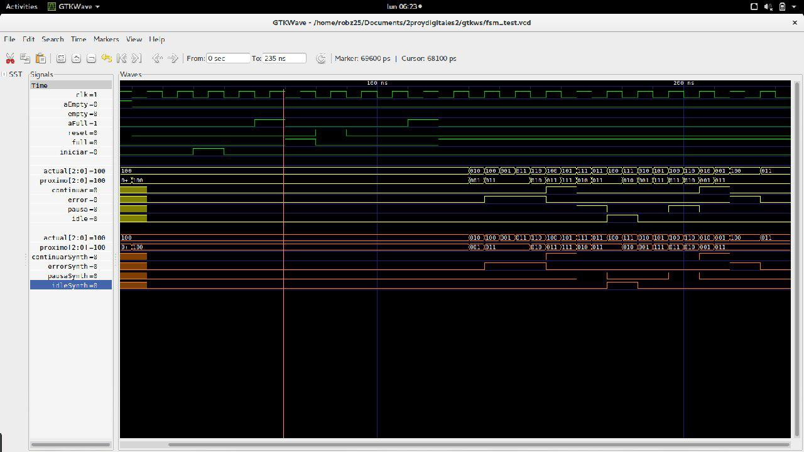
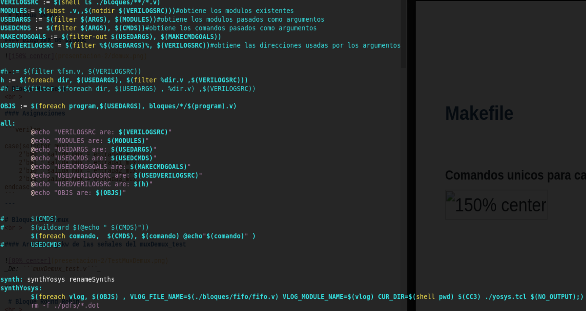

<!-- $theme: default -->

# Diseño de QoS para PCI

Tercera entrega
===

Robin Gonzalez
Boanerges Martinez
Emilio Rojas

---

# ```Avances```

###  ```Round Robin Arbitrado```, ```FSM```, ```Makefile```

### ```transmisor```


---

# Bloque Round Robin Arbitrado

```verilog
module roundRobinArbitrado #(
  parameter QUEUE_QUANTITY = 4,
  parameter DATA_BITS = 8,
  parameter BUF_WIDTH = 3,
  parameter MAX_WEIGHT = 64,
  parameter TABLE_SIZE = 8
) (
  input clk, rst, enb,
  [((QUEUE_QUANTITY)*($clog2(MAX_WEIGHT)))-1:0] pesos,
  [(TABLE_SIZE*$clog2(QUEUE_QUANTITY))-1:0] selecciones,
  [QUEUE_QUANTITY-1:0] buf_empty, 
  [(QUEUE_QUANTITY*BUF_WIDTH)-1:0] fifo_counter,
  output [$clog2(QUEUE_QUANTITY)-1:0] selector, 
  selector_enb
);
```

---  

#### Archivo .gtkw de las señales del roundRobin_test


_De: ```roundRobin_test.v```_


---  

# Maquina de estados

#### Archivo .gtkw de las señales del fsm_test

_De: ```fsm_test.v```_

---


 # Makefile
<br >

#### Comandos unicos para cada modulos



---
 # Bloque transmisor
<br >

#### Puertos y parametros
```verilog
module qos 
#(parameter DATA_WIDTH = 4, parameter QUEUE_QUANTITY = 4)
( output [DATA_WIDTH-1:0] output_qos,
  output [QUEUE_QUANTITY-1:0] error_full_qos, pausa_qos, 
  output [QUEUE_QUANTITY-1:0] continue_qos,
  output idle_qos,
  //inputs se単ales de control
  input clk, rst, enb, init,
  input uH,uL,
  input [1:0] vc_id, 
  input [QUEUE_QUANTITY-1:0] arbiterTable,
  //inputs data
  input [DATA_WIDTH-1:0] input_qos
  );
```


