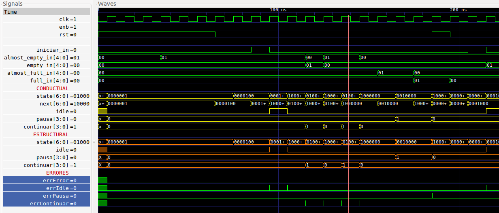

<!-- $theme: default -->

# Diseño de QoS para PCI

Avance Final
===

Robin Gonzalez
Boanerges Martinez
Emilio Rojas

---

# ```Avance Final```

###  ```Interfaz Round Robin```, ```FSM```, ```Makefile```

### ```Memoria```, ```transmisorQoS```, ```libreria osu018_stdcells```


---

# Bloque Interfaz Round Robin 

```verilog


```

---  

#### Archivo .gtkw de las señales del Interfaz Round Robin


_De: ```interfazRoundRobin_test.v```_


---  

# Maquina de estados

#### Archivo .gtkw de las señales del fsm_test

_De: ```fsm_test.v```_

---


 # Makefile
<br >

#### Comandos unicos para cada modulos

```verilog
make all fifo8
make view fifo
make all fifo8 fifo16 fsm 
make view fifo8 fifo16 fsm 
```

---

# Libreria osu018_stdcells
```verilog
`ifdef COMPILACION
codigo de osu018_stdcells.v
`endif

En el makefile:

CCFLAGS   = -Ttyp -g specify -g2005-sv -DCOMPILACION

```

---

 # Bloque transmisor
<br >

#### Archivo .gtkw de las señales del fsm_test

_De: ```fsm_test.v```_


