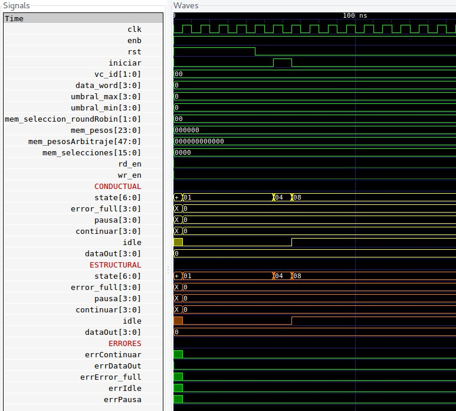

<!-- $theme: default -->

# Diseño de QoS para PCI

Avance Final
===

Robin Gonzalez
Boanerges Martinez
Emilio Rojas

---

# ```Avance Final```

###  ```Interfaz Round Robin```, ```FSM```, ```Makefile```

### ```Memoria```, ```transmisorQoS```, ```libreria osu018_stdcells```


---
# Bloque de Memorias

```verilog
always @ (posedge clk) begin
  if (iniciar) begin
    seleccion_roundRobin_out <=seleccion_roundRobin_in;
    pesos_out <= pesos_in;
    pesosArbitraje_out <= pesosArbitraje_in;
    selecciones_out <= selecciones_in;
    umbral_min_out <= umbral_min_in;
    umbral_max_out <= umbral_max_in;
  end
end
```
---

# Bloque Interfaz Round Robin 

```verilog
  input clk, rst, enb,
  [1:0] seleccion_roundRobin, 
  // 00,11: rrRegular, 
  // 01: rrPesado, 10: rrArbitrado
  [QUEUE_QUANTITY-1:0] buf_empty, 
  [QUEUE_QUANTITY*$clog2(MAX_WEIGHT)-1:0] pesos,
  [TABLE_SIZE*$clog2(MAX_WEIGHT)-1:0] pesosArbitraje,
  [TABLE_SIZE*$clog2(QUEUE_QUANTITY)-1:0] selecciones,
  
  output [$clog2(QUEUE_QUANTITY)-1:0] selector,
  selector_enb // Indica si existe un valor de salida.

```

---  

#### Archivo .gtkw de las señales del Interfaz Round Robin


_De: ```interfazRoundRobin_test.v```_


---  

# Maquina de estados

#### Archivo .gtkw de las señales del fsm_test

_De: ```fsm_test.v```_

---


 # Makefile
#### Comandos para cada modulos


---

# Libreria osu018_stdcells
```verilog
`ifdef COMPILACION 
codigo de osu018_stdcells.v 
`endif 
 ```
En el makefile: 
```
CCFLAGS   = -Ttyp -g specify -g2005-sv -DCOMPILACION 
```

---

 # Bloque transmisor
```verilog 
  parameter  
  QUEUE_QUANTITY = 4,   // se utilizan 4 filas fifo 
  DATA_BITS = 8,        // Los datos son de 8 bits 
  BUF_WIDTH = 3,        // Los datos son de 8 bits 
  MAX_WEIGHT = 64,      // El peso máximo es de 64 = 2^6 
  TABLE_SIZE = 8,     // Tamaño de la tabla de arbitraje 
  MAX_MAG_UMBRAL = 16,  // Tamaño máximo de los umbrales 
  TIPOS_ROUND_ROBIN = 3,// Cantidad de tipos RR 
  FIFO_COUNT = 5 // Cantidad de fifos 
```

---
```verilog
  input clk, rst, enb,
  iniciar,
  [$clog2(QUEUE_QUANTITY)-1:0]    vc_id,
  [BUF_WIDTH:0]                   data_word,
  [$clog2(MAX_MAG_UMBRAL)-1:0]    umbral_max,
  [$clog2(MAX_MAG_UMBRAL)-1:0]    umbral_min,
  [$clog2(TIPOS_ROUND_ROBIN)-1:0] 
      mem_seleccion_roundRobin,
  [QUEUE_QUANTITY*$clog2(MAX_WEIGHT)-1:0] 
      mem_pesos,
  [TABLE_SIZE*$clog2(MAX_WEIGHT)-1:0]
      mem_pesosArbitraje,
  [TABLE_SIZE*$clog2(QUEUE_QUANTITY)-1:0] 
      mem_selecciones,

  output [QUEUE_QUANTITY-1:0] error_full,
  output [QUEUE_QUANTITY-1:0] pausa,
  output [QUEUE_QUANTITY-1:0] continuar,
  output                      idle,
  output [BUF_WIDTH:0]        dataOut
```
---


